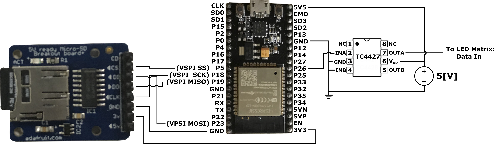

# Modular WS2812b Display - ESP32

A Project that aims to add control via phone application to a LED display
composed of WS2812b LEDs. The phone application communicates to the ESP32 via an
Access Point and updates the display real time as well as allows for sequences
to be set by default.

The repository contains the source code for the phone application. The app can be found via
Expo at:
https://exp.host/@vmlopez336/WS2812DisplayESP32

The repository for the ESP32 can be found at:
https://github.com/vmlopezr/modular-ws2812-display-esp32

The Wireless Access Point served by the ESP32 has the following settings:

```
Network SSID:  "Smart_Billboard_AP"
Network Pssword: "12345678"
```

To communicate with the ESP32, the phone application is needed as well as
connection to the Access Point above.

**Frame Creation**

The following is a demo of the live input screen that allows for live drawing on
the LED display.


**Frame Sequences**

The following is a demo of the default display screen. It allows for choosing a
sequence of frames to display.


## LED Display

The LED display is comprised of WS2812b LEDs. These can be acquired as LED strips,
or on PCB of different sizes. The project supports the use of 8 x 8 LED Matrices,
as well as the use of custom built displays with LED strips.

The figures below shows an example of the matrices supported by the application.


The CJMCU 8x8 matrix above routes the data signal starting from the VIN input in
the lower corner, and up along the columns. The signal then goes down onto the bottom
of the next column and follows upward.


The WS2812 8x8 matrix above routes the data signal in a similar fashion to the CJMCU
matrix. However, instead of routing back directly to the bottom of the next column,
the signal routes adjacently to the next column. The signal alternates from routing upwards,
then downwards and so on.

**NOTE:** When using the 8x8 Matrices, a larger display can be built by stacking the
grids across horizontally then going upwards. This is shown in the image below.


The application also supports single displays made from LED strips.
In this case, the display can be made into a single _h_ x _w_ where _h_ is the # of
LEDs along the height, and _w_ is the # of LEDs along the width.


## Development

The phone application was written in React Native using Expo CLI. To edit the
application, Expo CLI will be needed: https://docs.expo.io/

Clone the repository and run either, depending on the appropriate node package:
```
npm install

yarn install
```

Afterwhich, the development server can be run using:
``` expo start```


## Electrical Connections

The project uses the following components:

- NodeMCU ESP32 Development board
- SD card
- 5V Micro-SD breakout board
- TC4427 Dual High-Speed Power MOSFET Driver

The following diagram illustrates the pin connections used:



**NOTE:** The Power MOSFET driver used in the demo above is one that was already available at hand (originally used for small DC motors). It is rated for up to an output current of 1.5 A which is overkill for the data signal in this use case.

**WARNING:** When working with power supplies and electrical wiring, it is important to
follow the safety instructions and precautions provided by the supply.

The following are other alternatives for the data signal:

- Using the GPIO directly with the Data In. (The output is at the minimum limit for the Data In voltage)
- Other transistor configurations to switch a power supply
- Use of a level shifter to translate 3V up 5V.

### Powering the Display

The WS2812b LEDs in the Matrices and strips operate on +3.5 V to +5.3 V supply voltage.

At full brightness, with an supply voltage of 5 V, one LED is rated to draw up to 50 mA.
As a result, a 64 LED Matrix would be rated to draw up to about 3 A. An appropriately
rated power supply **must** be used when using these LEDs.

With that in mind, it is **IMPORTANT TO NOTE**, that the WS2812b should not be powered directly
from a microcontroller's 5 V VCC pin. This will damage the pin and even the microcontroller as the pins are usually rated to 40 mA or lower. The LED matrices must be powered directly from a power
supply.

## Limitations

The project only supports use of up to 1024 LEDS. Due to the use of the RMT peripheral in ["Esp32CrlLed.h"](./include/Esp32.CtrlLed.h), an array of size _n_ _x_ 24 _x_ 4 is needed, where _n_ is the total number of LEDs.

Due to the Max Heap allocation limit of about 113KB, a display of 1024 LEDs is the largest possible when using 8x8 matrices. When custom building a display via LED strips, the application may support up to 1200 LEDS.

There are other libraries that support WS2812b LEDs such as [FastLED](https://github.com/FastLED/FastLED) , Adafruit's [NeoPixel Library](https://github.com/adafruit/Adafruit_NeoPixel).

The following link illustrates a way to minimize the amount of RAM needed for a pixel, by generating the
data signal via bit-banging on a GPIO pin.

https://wp.josh.com/2014/05/13/ws2812-neopixels-are-not-so-finicky-once-you-get-to-know-them/

**NOTE:** The library written in the article uses some assembly code for the arduino's
AVR architecture. To use this idea with the ESP32 the code would need to be adapted.
